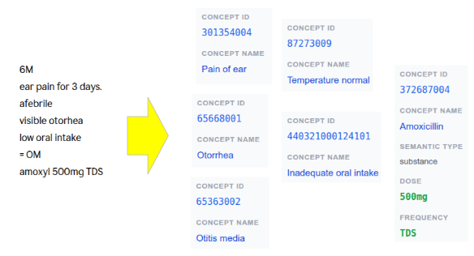

# SNOExtract

Lightweight offline SNOMED CT clinical concept extraction.

- Deterministic
- No outbound network calls — patient notes never leave the host
- CPU-only, 128 MB memory requirement 
- REST / gRPC / CLI / Python
- Runs on-premise or at the point of care (clinician in the loop review encouraged)

Extracts SNOMED concepts (CUIs, semantic types, negation/uncertainty/historicity context) from clinical free-text. Ships as a self-contained binary with data files — no Python install, no database, no internet calls at runtime.



## Try it live (web demo)

**[snomed-ner-demo-874953055038.australia-southeast1.run.app](https://snomed-ner-demo-874953055038.australia-southeast1.run.app/)** — paste a clinical note, see entities in your browser.

Demo runs in the cloud for convenience; production binaries are fully offline. Don't paste real patient data into the demo.
## SNOMED CT licensing — required before installing

SNOExtract embeds SNOMED CT-AU concept data, so using the binaries requires a current SNOMED CT licence. This is a SNOMED International obligation, not a SNOExtract one.

- **In Australia** — licences are issued at no charge to healthcare organisations and approved researchers via the [National Clinical Terminology Service](https://www.healthterminologies.gov.au/access-clinical-terminology/access-snomed-ct-au/snomed-ct-au-releases/) (NCTS), administered by the Australian Digital Health Agency.
- **Outside Australia** — apply through your country's National Release Centre, or directly via [SNOMED International](https://www.snomed.org/) for affiliate licensing.

The dist includes `SNOMED_CT_NOTICE.txt` covering the attribution and end-user obligations that apply to your usage.

## Download

Latest builds for Linux and Windows (x86_64):

**[github.com/pisong314/snoextract/releases/latest](https://github.com/pisong314/snoextract/releases/latest)**

| File | Platform |
|---|---|
| `snoextract-<version>-linux-x86_64.tar.gz` | Linux glibc 2.28+ (RHEL 8 / Ubuntu 20.04+) |
| `snoextract-<version>-windows-x86_64.zip`  | Windows 10/11, Server 2019+ |

Each build runs for 90 days, then you download a fresh build with the latest SNOMED CT-AU data. The exact date is printed in the bundled `README.txt`.

## Quickstart

Pick the interface that matches how you'll use it.

### 1. Single-call CLI — `<100 ms` per call

`snoextract-json` reads JSON on stdin, writes JSON on stdout. Fresh process per call, ~70–100 ms load-dominated. Best for **ad-hoc use and low-volume integrations** — for bulk work, use server mode (6× faster per note).

| | Linux / macOS                                                                                       | Windows (cmd)                                                                                  |
|---|---|---|
| **Run** | `echo '{"text":"Pt on Metformin 1g BD for diabetes mellitus."}' \| ./snoextract-json` | `echo {"text":"Pt on Metformin 1g BD for diabetes mellitus."} \| snoextract-json.exe` |
| **Or from file** | `./snoextract-json --input-file in.json --output-file out.json`                          | `snoextract-json.exe --input-file in.json --output-file out.json` |

Output (truncated):

```json
{
  "version": "0.34.5",
  "entities": [
    { "text": "Metformin", "start": 6, "end": 15, "cui": "372567009",
      "name": "Metformin", "semantic_type": "substance", ... },
    { "text": "diabetes mellitus", "start": 23, "end": 40, "cui": "73211009",
      "name": "Diabetes mellitus", "semantic_type": "disorder", ... }
  ]
}
```

Full input/output schema is in the bundled `README.txt`.

### 2. REST server — 30–60 notes/sec sustained

`snoextract-server --http-listen` exposes a JSON HTTP API — data loads once, per-note cost is inference only. Best for **batch and multi-client workloads**.

| | Linux / macOS                                                                              | Windows (cmd)                                                                              |
|---|---|---|
| **Start** | `./snoextract-server --http-listen 127.0.0.1:50052`                              | `snoextract-server.exe --http-listen 127.0.0.1:50052`                                            |
| **Call**  | `curl -s -X POST http://127.0.0.1:50052/v1/extract -H 'content-type: application/json' -d '{"text":"chest pain"}'` | `curl -s -X POST http://127.0.0.1:50052/v1/extract -H "content-type: application/json" -d "{\"text\":\"chest pain\"}"` |

REST is off by default — `--http-listen` opts in. Loopback-only binding (no auth, no TLS).

### 3. Python (in-process, zero overhead)

Pre-built wheel ships under `wheels/`. Requires Python 3.10+.

```bash
python3 -m pip install wheels/snoextract-0.34.5-cp310-abi3-*.whl
```

```python
from snoextract import Pipeline

pipeline = Pipeline.load("./data")
result = pipeline.process("Patient has chest pain and diabetes mellitus.")
for e in result.entities:
    print(e.text, e.cui, e.name, e.semantic_type)
```

One wheel works across CPython 3.10/3.11/3.12/3.13 (abi3).

## More

- **[docs/benchmarks.md](docs/benchmarks.md)** — perf and accuracy numbers
- **[docs/grpc.md](docs/grpc.md)** — gRPC interface (`.proto` contract, client codegen for Python / Go / Node / C#)
- **[docs/python.md](docs/python.md)** — Python API: entity attributes, context flags (negation / uncertainty / historicity)

## Reporting issues or terminology gaps

Bugs and feature requests → **[Issues](https://github.com/pisong314/snoextract/issues)**.

Please include the dist version, your OS, and a minimal repro. The issue templates prompt for these.

**Terminology curation is ongoing.** Coverage prioritises Australian clinical contexts (GP notes, discharge summaries, common diagnoses and medications). If a concept you'd expect isn't matched — or is matched to the wrong CUI — open an Issue with the input snippet and the expected CUI. Your reports help improve coverage over time.

Maintained by **Dr Pi Songsiritat MBBS FRACGP** — [piyawoot.song@gmail.com](mailto:piyawoot.song@gmail.com). Questions and feedback welcome.